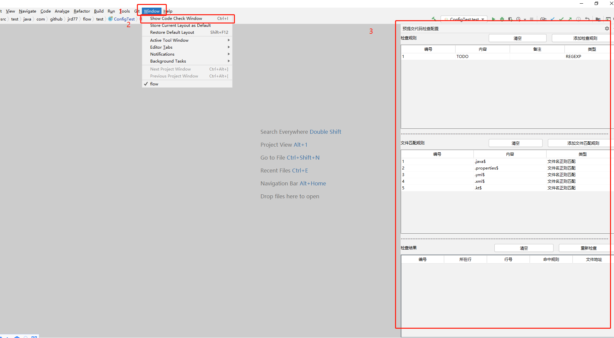
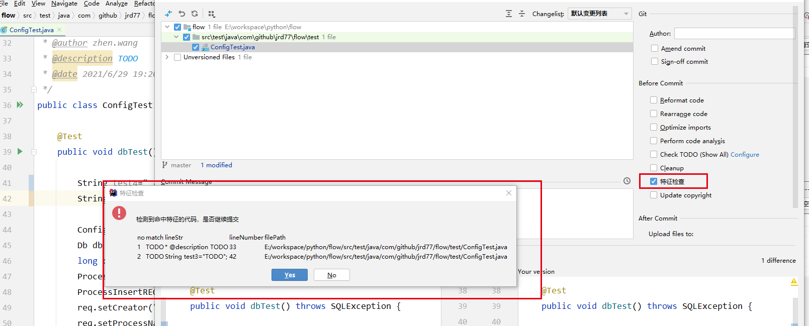
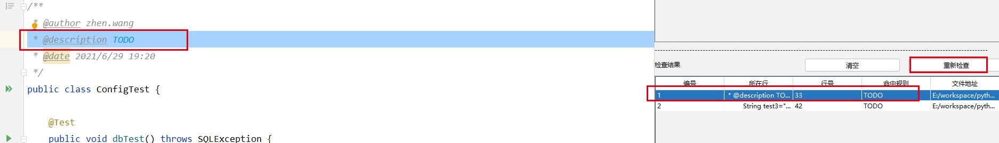

VCS Commit Code Check

    默认检查 JAVA/YAML/PROPERTIES/XML/kt  文件 

在'*Window*'->'*Show Code Check Window*'打开窗口'**预提交代码检查配置**'（快捷键 Ctrl + I）
>

可以在 **检查规则->添加检查规则** 添加检查规则（,默认正则），在**文件匹配规则->添加文件匹配规则**添加检查文件规则()，

在提交的时候自动勾选检查选项'特征检查'，会自动检查符合规则的代码行
>

同样也可以使用窗口'**预提交代码检查配置**'下面'**重新检查**'按钮，预览检查结果，点击检查结果表格行，自动跳转有问题的代码
>